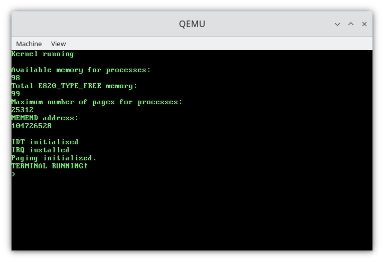
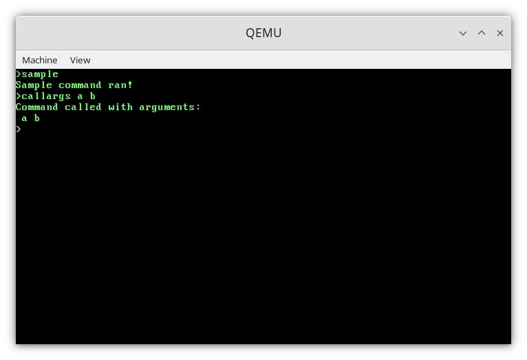
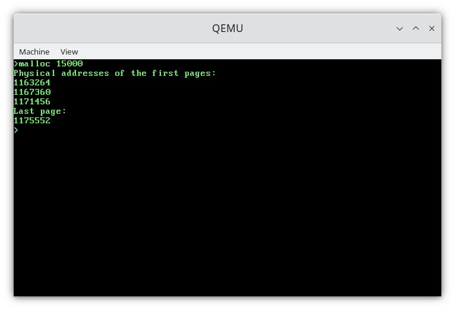

# Protovima-kernel

My first step in kernel programming. More of a playground than an actual project.

Goal: a kernel managing the CPU, interrupts, memory, processes, etc, along with a shell with some basic commands. 

Meant to run on any single-core CPU with an i386 architecture. 

==========================

**DISCLAIMER**:  
C is not my cup of tea, so be prepared for some weird code here.

==========================

###  Building and running: 

All you need is gcc, nasm, and ld for building, and qemu for running.

If unable to use ./run.sh, do this:
make clean
make all 
qemu-system-i386 -m 500M -fda os.img 

==========================

###  Protovima in action: 

==========================

Bootloader&Makefile largely based on::

https://dev.to/frosnerd/writing-my-own-boot-loader-3mld

and 

https://github.com/vitaminac/minios

==========================

###  OS programming resources: 

osdev.org
 lowlevel.eu
 jamesmolloy.co.uk
 reddit.com/r/osdev/
 https://os.phil-opp.com
 
 Operating System Concepts - Silberschatz-Gagne-Galvin
 Modern Operating Systems - Tanenbaum (The MINIX book)

==========================
